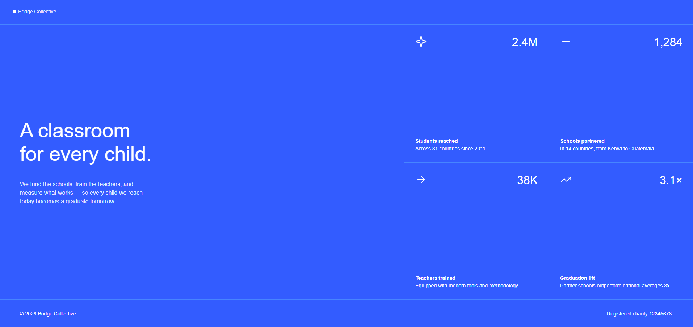
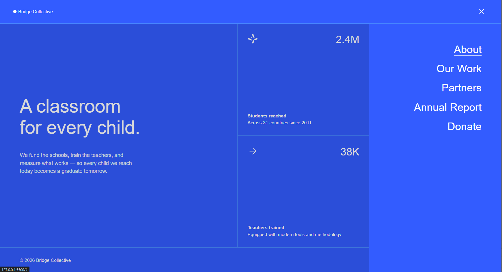
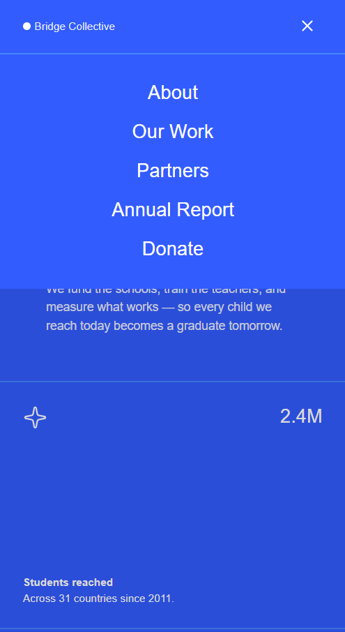
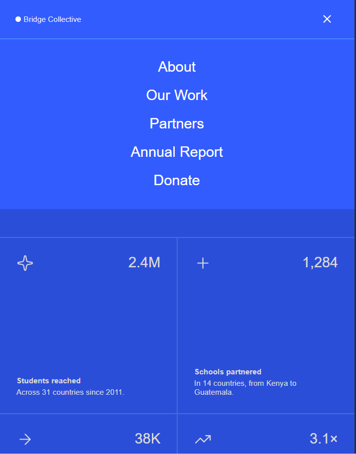

# 🌱 Grid Landing Page — Frontend Mentor Challenge

> A responsive landing page built for the **Grid Landing Page** Frontend Mentor challenge, practicing **CSS Grid Layout**, **Flexbox**, semantic HTML5, and pure CSS styling without external frameworks.

[](https://img.shields.io/badge/HTML5-E34F26?style=for-the-badge&logo=html5&logoColor=white) [](https://img.shields.io/badge/CSS3-1572B6?style=for-the-badge&logo=css3&logoColor=white) [](https://img.shields.io/badge/CSS_Grid-38B2AC?style=for-the-badge&logo=css3&logoColor=white)

---

## 📌 Live Demo

> 🔗 **[Click here to view the live project](https://gunnaroliveira.github.io/FrontendMentor-Challenge-GRID-LANDING-PAGE/)**

---

## 📸 Screenshots

### Desktop




### iPad



### Mobile



---

## 📜 About the Project

This project is the solution for the **Grid Landing Page** challenge from [Frontend Mentor](https://www.frontendmentor.io/), built to practice structuring complex layouts using **CSS Grid** for the overall page architecture (header, main, and footer) and **Flexbox** for internal component alignment, including a fully responsive navigation menu built with pure HTML and CSS.

---

## 🛠️ Built With

- **HTML5**: semantic markup for better structure and accessibility.
- **CSS3**: CSS variables, media queries, and advanced pseudo-classes for responsiveness.
- **CSS Grid**: used across the overall layout architecture (`grid-template-areas`, `grid-template-columns`, `grid-template-rows`).
- **Flexbox**: used within individual components for internal alignment.
- **Checkbox Hack + `:has()`**: used to build the mobile menu and the background overlay with zero JavaScript.

---

## 📁 Repository Structure

```
FrontendMentor-Challenge-GRID-LANDING-PAGE/
├── assets/                    # Images and icons used across the project
├── css/                       # Stylesheets
│   ├── footer.css
│   ├── global.css
│   ├── header.css
│   ├── main.css
│   └── style.css              # Entry point, imports all other stylesheets
├── design/                    # Design files provided by the challenge
├── screenshots-preview/       # Layout preview images for this README
│   ├── desktop-layout.png
│   ├── desktop-menu-active-layout.png
│   ├── ipad-menu-active-layout.png
│   └── mobile-menu-active-layout.png
├── index.html                  # Main HTML file
├── preview.jpg                 # Project preview image
└── style-guide.md              # Style guide provided by the challenge
```

---

## 💡 Challenges and Takeaways

One of my main difficulties was keeping the code organized while trying to keep the CSS and HTML clean when using Grid Layout properties.

Building the menu with pure CSS and HTML was already an experience I had gone through on the [Bikcraft](https://gunnaroliveira.github.io/BIKCRAFT-PROJECT/) project, but it was fun to relearn how to write more refined pseudo-classes to get the level of selection I was looking for.

I also had a bit of trouble remembering how to create the blur/dark overlay for when the menu is active.

It was a lot of fun and a great practice. I was also able to implement `clamp()` for responsive fonts.

---

## 🚀 Getting Started

To run this project locally, follow these steps:

1. **Clone the repository:**

```
git clone https://github.com/GunnarOliveira/FrontendMentor-Challenge-GRID-LANDING-PAGE.git
```

2. **Navigate to the project folder:**

```
cd FrontendMentor-Challenge-GRID-LANDING-PAGE
```

3. **Open `index.html`** in your web browser (or use the *Live Server* extension in VS Code).

---

## 👤 Author

Developed by **Gunnar Oliveira**.

- **GitHub**: [@GunnarOliveira](https://github.com/GunnarOliveira)
- **Project Link**: [FrontendMentor-Challenge-GRID-LANDING-PAGE](https://github.com/GunnarOliveira/FrontendMentor-Challenge-GRID-LANDING-PAGE)

---

### Challenge by [Frontend Mentor](https://www.frontendmentor.io?ref=challenge). Feel free to explore the project and methodology, share any feedback or suggestions, and don't forget, Jesus Loves You! ✨
